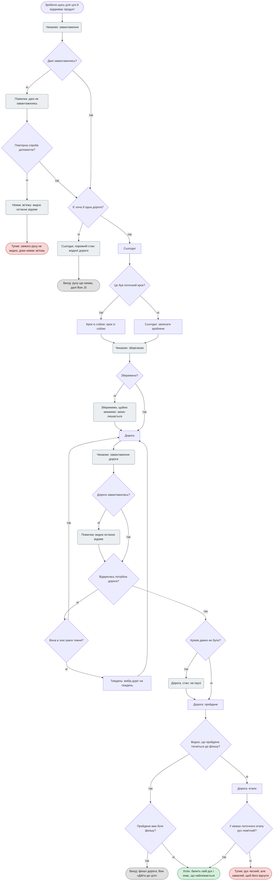
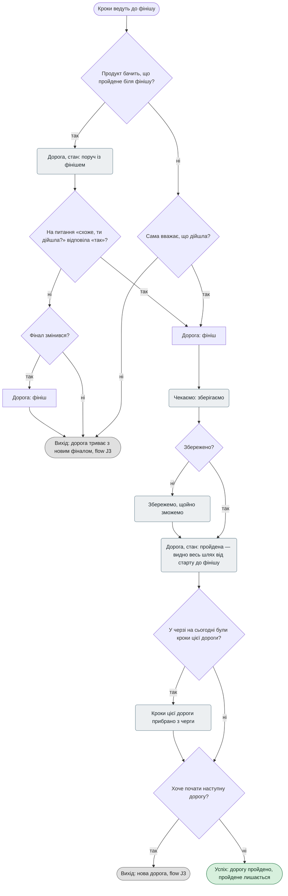
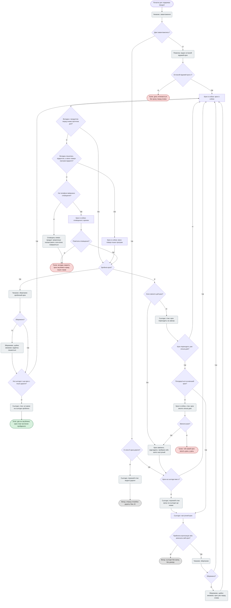
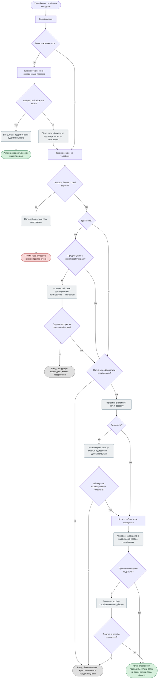
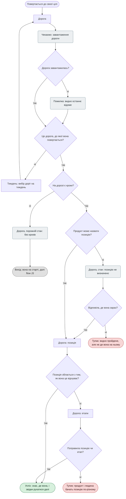
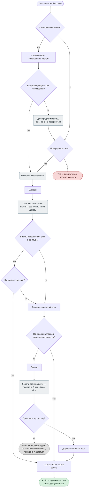
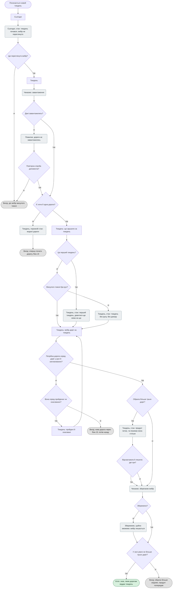

# WAY — user flows

**Стан:** чернетка · **Створено:** 2026-09-30 · **Оновлено:** 2026-09-30 — внесено критику ([`audit.md`](audit.md)), рішення з опитування й технічні факти з [`research.md`](../research/research.md) §7 · **Виросло з:** [`sitemap.md`](sitemap.md) і [`jtbd.md`](../research/jtbd.md)

**Що тут.** Вісім діаграм: main job, її фінал і шість related jobs. Зведена сторінка — [`ia.html`](ia.html).

| # | Flow | Чому взято |
|---|---|---|
| 1 | [J0 · Бачити свій рух](#j0--бачити-свій-рух) | Main job |
| 2 | [J0 · Дійти до цілі](#j0--дійти-до-цілі) | Фінал main job: без нього «відсутність фіналу» лишається (бриф §1) |
| 3 | [J4 · Не загубити сьогоднішню дію](#j4--не-загубити-сьогоднішню-дію) | Перша в ядрі MVP |
| 4 | [J4 · Узяти крок із собою](#j4--узяти-крок-із-собою) | Під-flow: вікно на комп'ютері й сповіщення на телефоні |
| 5 | [J3 · Зрозуміти, що робити далі](#j3--зрозуміти-що-робити-далі) | Друга в ядрі MVP |
| 6 | [J2 · Зрозуміти, де я зараз](#j2--зрозуміти-де-я-зараз) | Третя в ядрі MVP |
| 7 | [J5 · Повернутися після паузи](#j5--повернутися-після-паузи) | Персона 2; до критики не мала жодної діаграми |
| 8 | [J1 · Обрати, чому віддати увагу](#j1--обрати-чому-віддати-увагу) | Практика замовника; єдиний шлях через «Тиждень» |

**Як читати діаграми.**

| Вузол | Що це |
|---|---|
| Прямокутник | Екран або секція. Назви — з дерева в sitemap.md: «Екран» або «Екран: секція» |
| Ромб | Рішення з гілками «так» і «ні» |
| Заокруглений прямокутник | Стан екрана: порожній, «чекаємо», помилка, «збережемо, щойно зможемо» та інші |
| Овал | Початок або кінець. Зелений — успіх, червоний — тупик, сірий — вихід в інший flow чи свідомий кінець |

**Два правила, спільні для всіх діаграм.**
- **Помилка збереження не зациклюється.** Після неї — стан «збережемо, щойно зможемо»: уведене лишається на екрані, людина йде далі.
- **Помилка завантаження показує останнє відоме,** а не порожнечу.

---

## J0 · Бачити свій рух

> «Коли я роблю щось для цілі, до якої ще далеко, я хочу бачити свій рух таким, яким він є, навіть коли він малий, щоб знати, що наближаюся, а не стою на місці.»

**Рішення.**
- *Це був поточний крок?* Так — відмітка з плаваючого кроку, один тап. Ні — «записати зроблене» заднім числом, одним рядком: рух, якого не планували, теж потрапляє на дорогу.
- *Відкрилась потрібна дорога?* Пункт «Дорога» відкриває дорогу поточного кроку. Інша дорога тижня — перемикач на тому ж екрані; дорога поза зоною — через «Тиждень».
- *Видно, що пройдене тягнеться до фінішу?* Головне питання flow. Фініш людина описала на старті; ШІ показує, чи рух іде до нього.
- *У межах поточного етапу рух помітний?* Остання спроба: менша рамка, ніж уся дорога.

**Стани:** завантаження · помилка · немає зв'язку (видно останнє відоме) · «Сьогодні» без доріг · зберігаємо · збережемо, щойно зможемо · завантаження дороги · дорога на паузі.

**Кінці.**
- **Успіх:** бачить свій рух і знає, що наближається.
- **Вихід у J3:** руху ще немає.
- **Вихід у фінал:** пройдене біля фінішу.
- **Тупик: свіжого руху не видно без зв'язку.** Видно лише останнє відоме.
- **Тупик: рух чесний, але замалий.** Напруга між J0 і E1 (personas.md). Чи рятує менша рамка етапу — гіпотеза H1, не перевірена.

---

## J0 · Дійти до цілі

> Фінал main job. Бриф обіцяє прибрати «відсутність фіналу» (§1): дорога має вміти закінчитися.

**Рішення.**
- *Продукт бачить, що пройдене біля фінішу?* Фініш описано на старті; ШІ порівнює з ним пройдене. Продукт лише питає, закриває людина (D31).
- *Фінал змінився?* Людина могла дорогою зрозуміти, що хоче іншого. Тоді вона уточнює фінал, і дорога триває.
- *Сама вважає, що дійшла?* Дія «я дійшла» є завжди, не лише коли продукт спитав.

**Стани:** поруч із фінішем · зберігаємо · збережемо, щойно зможемо · пройдена · кроки дороги прибрано з черги.

**Що стається з пройденою дорогою.** Виходить із зони уваги, сповіщення про неї мовчать, на «Тижні» вона серед пройдених; пройдене лишається (D12). Так само роблять Things (Logbook) та Intend (research.md §7.7).

**Кінці.** Успіх — дорогу пройдено. Два виходи в J3: дорога триває або людина починає нову. Тупиків немає.

---

## J4 · Не загубити сьогоднішню дію

> «Коли мій день заповнюють інші справи, я хочу тримати перед очима одну дію для своєї цілі, доки її не зроблю, щоб не загубити її серед решти.»

**Рішення.**
- *Крок на сьогодні вже є?* Він є, якщо вчорашній не зроблено або людина вже прийняла крок: прийнятий крок одразу стає кроком на сьогодні.
- *Вкладка перед очима? Вікно? Сповіщення?* Три заслони між кроком і «загубився». Поки вкладку відкрито, крок висить плаваючим елементом на кожному екрані.
- *Вкладка лишилась відкритою, а вікно поверх програм відкрите?* Вікно живе рівно стільки, скільки вкладка продукту: закрита вкладка закриває й вікно (research.md §7.1). Тож вікно рятує, коли вкладка загубилась серед інших, але не коли її закрили.
- *Помітила сповіщення?* На Android у Chrome крок можна відмітити зробленим просто зі сповіщення; на iPhone кнопок у сповіщенні немає (research.md §7.4).
- *На сьогодні є ще крок з іншої дороги?* Перед очима один крок; зроблений змінюється наступним.
- *Хоче змінити цей крок?* П'ять дій: зроблено · взяти наступний · замінити · відкласти · прибрати. Жодна не подається як провал.
- *Погоджується на менший крок?* Продукт пропонує його сам, коли крок висить кілька днів [?].

**Стани:** завантаження · останній відомий крок · «Сьогодні» без доріг · кроку на сьогодні ще немає · зберігаємо · збережемо, щойно зможемо · сповіщень немає · усі кроки на сьогодні зроблено · крок змінено · крок переходить на завтра · крок висить кілька днів.

**Кінці.**
- **Успіх:** дію не загублено.
- **Вихід: сьогодні без кроку.** Не тупик, а стан без докору (E3); секція «наступний крок» лишається під рукою.
- **Тупик: день без кроку перед очима** — дані не завантажились і останнього відомого кроку немає.
- **Тупик: вкладку закрито, крок загубився.** Найважчий: саме від цього рятував аркуш. Лишається там, де не спрацював жоден заслін, — і вікно тут не допоможе, бо закривається з вкладкою. Цільове рішення — застосунки й віджет.
- **Тупик: крок висить день у день.** Людина не змінила його й не погодилась на менший. Доки висить, черга з інших доріг не рухається.

---

## J4 · Узяти крок із собою

Під-flow до J4: як крок потрапляє у вікно поверх інших програм і в сповіщення на телефоні.

**Рішення.**
- *Вона за комп'ютером?* Дві гілки: вікно на комп'ютері, сповіщення на телефоні. Одна не виключає іншої.
- *Браузер уміє відкрити вікно?* Chrome, Edge і Opera на комп'ютері, Firefox — з версії 151; Safari — ні, на телефонах — ні. Вікно відкривається лише у відповідь на дію людини й закривається разом із вкладкою (research.md §7.1).
- *Телефон бачить ті самі дороги?* Поки діє рамка `ESTIMATE.md` §1 з файлами на комп'ютері — ні, і секцію показуємо як «поки недоступно», замість того щоб вести в інструкцію.
- *Це iPhone?* На iPhone сповіщення працюють лише для продукту, доданого на початковий екран, з iOS 16.4 (research.md §7.5). «Ні» — Android: там встановлювати не обов'язково, але Chrome потрібен системний дозвіл на сповіщення (§7.3).
- *Увімкнула в налаштуваннях телефона?* Після відмови сайт не може спитати вдруге — повернути дозвіл можна лише в налаштуваннях (§7.2). Тому друга інструкція обов'язкова.

**Стани:** вікно відкрито · браузер не підтримує · поки недоступно · застосунок не встановлено · системний запит · у дозволі відмовлено · пробне сповіщення · пробне не надійшло.

**Кінці.** Два успіхи — вікно і сповіщення. Два виходи без провалу — людина відклала інструкцію або обійшлася без сповіщень. Один тупик — дані на телефоні недоступні; його знімає лише рішення про сервер.

---

## J3 · Зрозуміти, що робити далі

> «Коли я знаю, куди хочу прийти, але не знаю, які дії мене туди приведуть, я хочу зрозуміти, що робити наступним, щоб наблизитися до цілі.»

```mermaid
flowchart TD
    a0(["Знає, куди хоче прийти, але не знає дій"]) --> a1{"Дорога до цієї цілі вже є?"}
    a1 -->|так| c0["Дорога: наступний крок"]
    a1 -->|ні| a2{"Є хоча б одна дорога?"}
    a2 -->|ні| a3("Сьогодні, порожній стан: жодної дороги")
    a3 --> b1
    a2 -->|так| a4["Тиждень"]
    a4 --> b1["Нова дорога: фінал"]
    b1 --> b2{"Може описати фінал?"}
    b2 -->|ні| b3("Нова дорога, стан: порожня")
    b3 --> z1(["Тупик: фінал не сформульовано, дорогу не почато"])
    b2 -->|так| b4["Нова дорога: точка старту"]
    b4 --> b5{"Описує, де вона зараз?"}
    b5 -->|так| b6["Нова дорога: перший крок"]
    b5 -->|ні| b6
    b6 --> c1("Чекаємо: продукт готує пропозицію")
    c0 --> c1
    c1 --> c2{"Пропозиція надійшла?"}
    c2 -->|ні| c3("Помилка чи ліміт ШІ: пропозицію не отримано")
    c3 --> c4{"Повторна спроба допомогла?"}
    c4 -->|так| c5
    c4 -->|ні| d1
    c2 -->|так| c5{"Пропозиція підходить?"}
    c5 -->|так| e1
    c5 -->|ні| c6{"Відкласти її?"}
    c6 -->|так| c7("Відкладено: точка без лінії на дорозі")
    c7 --> c8
    c6 -->|ні| c8{"Уже було дві-три невдалі пропозиції?"}
    c8 -->|ні| c1
    c8 -->|так| d1{"Може записати крок сама?"}
    d1 -->|так| e1
    d1 -->|ні| d2("Наступний крок: два-три запитання замість пропозиції")
    d2 --> d3{"Сформулювала крок із запитань?"}
    d3 -->|так| e1
    d3 -->|ні| z2(["Тупик: ні пропозиції, ні власного кроку"])
    e1{"Крок можна зробити за день?"}
    e1 -->|ні| c1
    e1 -->|так| e2("Чекаємо: зберігаємо крок")
    e2 --> e3{"Збережено?"}
    e3 -->|ні| e4("Збережемо, щойно зможемо: крок лишається")
    e4 --> e5
    e3 -->|так| e5{"Це нова дорога?"}
    e5 -->|так| e6["Нова дорога: коли почати"]
    e6 --> e7{"Починає зараз і додає в зону уваги?"}
    e7 -->|так| e8["Сьогодні: крок дня"]
    e7 -->|ні| x1(["Вихід: дорога запланована, крок чекає її тижня"])
    e5 -->|ні| e8
    e8 --> ok(["Успіх: знає наступний крок, обрала його сама, і він уже на сьогодні"])

    classDef state fill:#eceff1,stroke:#607d8b,color:#1c262b
    classDef good fill:#d7f0dd,stroke:#2e7d4f,color:#0f2e1c
    classDef dead fill:#f8d7d7,stroke:#b03a3a,color:#3a0f0f
    classDef exit fill:#e0e0e0,stroke:#757575,color:#212121
    class a3,b3,c1,c3,c7,d2,e2,e4 state
    class ok good
    class z1,z2 dead
    class x1 exit
```

**Рішення.**
- *Може описати фінал?* Фінал — єдине обов'язкове поле нової дороги. Точку старту можна пропустити й дописати на «Дорозі»; недописана дорога зберігається як чернетка.
- *Пропозиція надійшла?* Пропозицію готує ШІ (кандидат — Groq). Помилка й денний ліміт ведуть сюди ж; після невдалого повтору — запасні шляхи.
- *Відкласти її?* Відкладена пропозиція лягає на дорогу точкою без лінії; продукт згадає про неї пізніше.
- *Уже було дві-три невдалі пропозиції?* Лічильник проти безкінечної петлі й проти витрати ліміту ШІ.
- *Може записати крок сама? Сформулювала крок із запитань?* Два запасні шляхи, коли пропозиції немає.
- *Крок можна зробити за день?* Якщо ні — продукт пропонує менший [?].
- *Починає зараз і додає в зону уваги?* Наприкінці «Нової дороги» продукт питає, чи додати її в зону уваги цього тижня і коли людина планує почати.

**Стани:** «Сьогодні» без доріг · нова дорога порожня · чекаємо на пропозицію · помилка чи ліміт ШІ · відкладено · запитання замість пропозиції · зберігаємо · збережемо, щойно зможемо.

**Кінці.**
- **Успіх:** знає наступний крок, обрала його сама, і він уже на сьогодні — прийнятий крок одразу стає кроком дня.
- **Вихід: дорога запланована.** Її крок чекає тижня, коли людина планує почати.
- **Тупик: фінал не сформульовано.** Форма питає про те, чого людина ще не сформулювала. Пом'якшує лише те, що фінал — одне-два речення.
- **Тупик: ні пропозиції, ні власного кроку, ні відповіді на запитання.** Сама ситуація J3, до якої людина повернулась. Став вужчим: між ним і людиною тепер три шляхи.

---

## J2 · Зрозуміти, де я зараз

> «Коли я повертаюся до своєї цілі, я хочу розуміти, де я зараз, щоб знати, звідки рухатися далі.»

**Рішення.**
- *Продукт може назвати позицію?* Позицію виводить продукт (D22): з пройденого, фіналу й етапів. Звідки саме — O12, робочий напрям — ШІ. Коли вивести нема з чого, продукт питає людину.
- *Позиція збігається з тим, як вона це відчуває?* Продукт рекомендує, людина вирішує (D31): вона може поправити позицію чи етап [?].

**Стани:** завантаження дороги · останнє відоме · без кроків · позицію не визначено.

**Кінці.** Успіх — знає, де вона. Вихід у J3 — вона на старті. Два тупики стоять на O12: продукт не може назвати позицію, а людина не відповіла; або вони бачать її по-різному, і людина не поправила.

---

## J5 · Повернутися після паузи

> «Коли я на кілька днів випала з роботи над ціллю, я хочу продовжити з того місця, де зупинилась, щоб не починати спочатку.»

**Рішення.**
- *Сповіщення ввімкнені?* Сповіщення «після паузи» — одне; входить у частоту, яку обрала людина. Далі продукт мовчить (sitemap.md, «Сповіщення»).
- *Висить незроблений крок з до паузи? Він досі актуальний?* Старий крок не зникає сам і не стає докором: людина вирішує, чи лишити його.
- *Продовжує цю дорогу?* Якщо ні — дорогу можна зробити запланованою на пізніше або скасувати; пройдене лишається (D12).

**Стани:** після сповіщення — тиша · завантаження · «Сьогодні» після паузи · дорога на паузі з пройденим і позицією.

**Кінці.** Успіх — продовжила з того місця. Вихід — свідомо відклала чи скасувала дорогу. Тупик — людина не повернулась, а продукт після одного сповіщення мовчить. Це свідома ціна: наполегливіші нагадування тиснуть (E4).

---

## J1 · Обрати, чому віддати увагу

> «Коли в мене кілька власних проєктів одночасно, я хочу наперед вирішити, яким із них віддам увагу наступного тижня, щоб рухатися в обраних, а не розпорошуватися.»

**Рішення.**
- *Іде переглянути вибір?* Якщо ні — діє вибір минулого тижня; у найперший тиждень — усі дороги в русі. Тупика «тиждень без вибору» більше немає.
- *Це перший тиждень? Минулого тижня був рух?* Секція «що зрушило» має порожній стан і стан без руху — обидва без докору (E3).
- *Потрібна дорога серед доріг у русі й запланованих?* «Усі дороги» влились у «Тиждень»: вибір — з одного місця, без переходів.
- *Обрала більше трьох доріг?* Межі немає; продукт питає, чи втримає людина стільки, і пропонує відсортувати. Відмова — теж відповідь.

**Стани:** тиждень почався · завантаження · помилка · жодної дороги · перший тиждень · тиждень без руху · продукт питає · зберігаємо · збережемо, щойно зможемо.

**Змінити вибір можна будь-коли:** той самий flow з будь-якого дня тижня; «вибір зроблено» — не кінцевий стан.

**Кінці.** Успіх — вибір щось відсіяв. Чотири виходи без провалу: діє минулий вибір; спершу почати дорогу; нова дорога через J3; свідомо широкий вибір. Тупиків немає.

---

## Що видно з восьми flows

- **Тупиків лишилось одинадцять, і жоден не виникає через дірку в діаграмі.**
  - Чотири стоять на відкритих питаннях: крок загубився поза вкладкою (D29 і цільові застосунки), телефон не бачить даних (рамка `ESTIMATE.md` §1), двічі — позиція (O12).
  - Чотири — на межі того, що продукт може зробити за людину: фінал не сформульовано; ні пропозиції, ні власного кроку; крок висить, і людина його не змінює; день без кроку перед очима, коли даних немає взагалі.
  - Три — на свідомих рішеннях: рух замалий, щоб відчути (H1); продукт мовчить після одного сповіщення (E4); без зв'язку не видно свіжого руху.
- **Помилки збереження більше не зациклені.** Скрізь — «збережемо, щойно зможемо».
- **Прийнятий крок одразу стає кроком дня** — розрив між «що робити далі» і «не загубити дію» закрито.
- **У flow J1 і «Дійти до цілі» тупиків немає зовсім.**

## Звірка з sitemap.md

Усі вузли-екрани є в дереві sitemap.md; перевірено скриптом. Нових екранів flows не дали. Стани екранів із діаграм є в таблиці станів sitemap.md; проміжні — «крок змінено», «кроки прибрано з черги», «тиша після сповіщення» — живуть лише в діаграмах.
